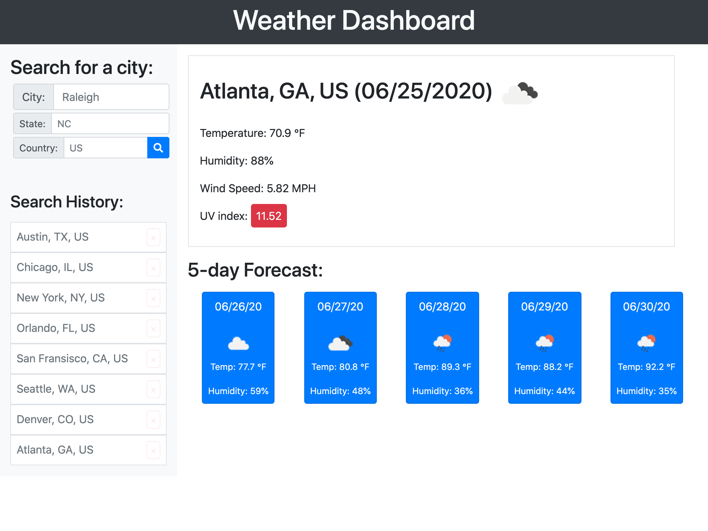
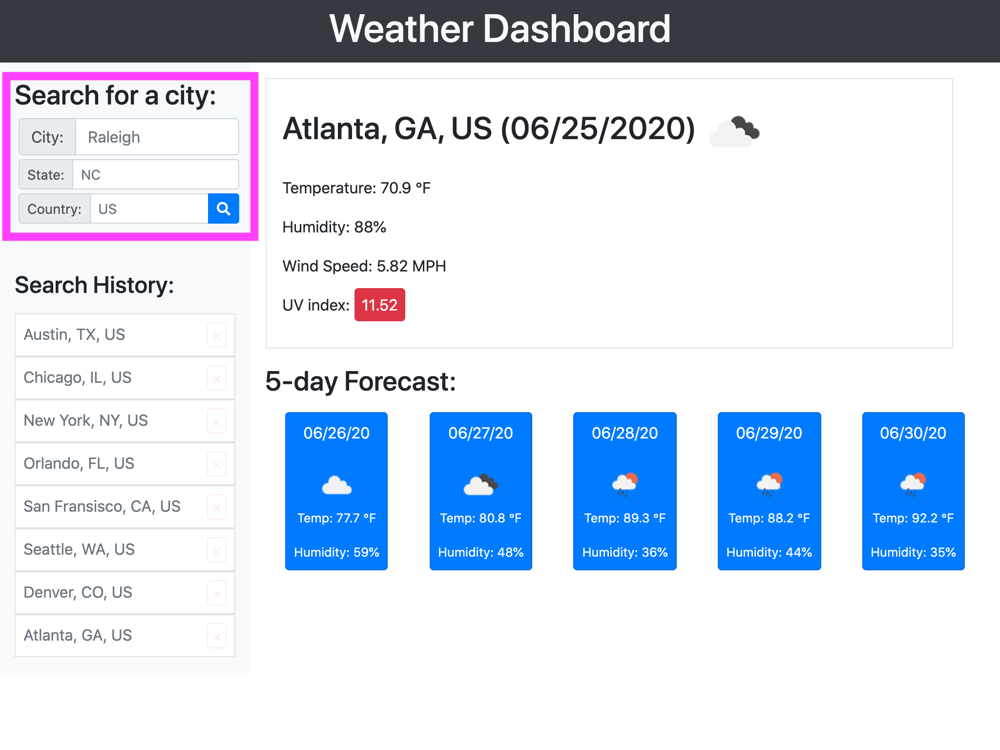
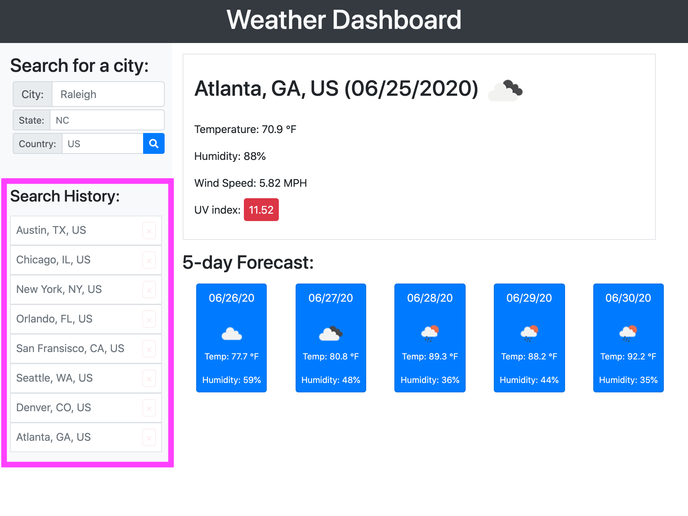

# [Weather Dashboard](https://thadkingcole.github.io/weather_dashboard)

 

A simple weather dashboard that shows the user the weather outlook for multiple cities. Using [OpenWeather API](https://openweathermap.org/api), the user can find the weather for their desired location. The locations searched are saved for easy reviewing, and can be removed as desired by the user.

## Usage

### Getting Started

First, navigate to <https://thadkingcole.github.io/weather_dashboard>

If this is your first time visiting the page, the weather for Raleigh, NC will be displayed. If Raleigh's weather is not of interest to you, you can [search for a new city](#searching-for-a-new-city).

### Searching for a New City

To find the weather of a new city, simply type in that city into the search bar and hit enter or press the blue search button.

You can help narrow the search by including the 2 letter state abbreviation (if applicable) and/or the 2 letter country abbreviation. This is especially useful to distinguish between two cities in different states that share the same name such as Albany, NY and Albany, GA.

### Search History

With each city you find, it will be added to your search history directly below the search bar on the left side of the page.

To view the weather for any of the cities in your search history, simply click on that city. If you wish to remove a city from your history, click the red &times; to the right of the city you wish to remove.

## Credits

Thanks to [OpenWeather](https://openweathermap.org/) and their [suite of APIs](https://openweathermap.org/api).

## License

[GPL 3.0](LICENSE)
